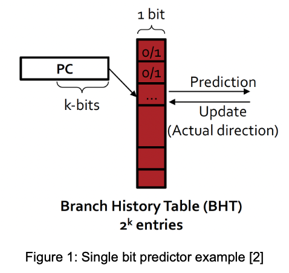
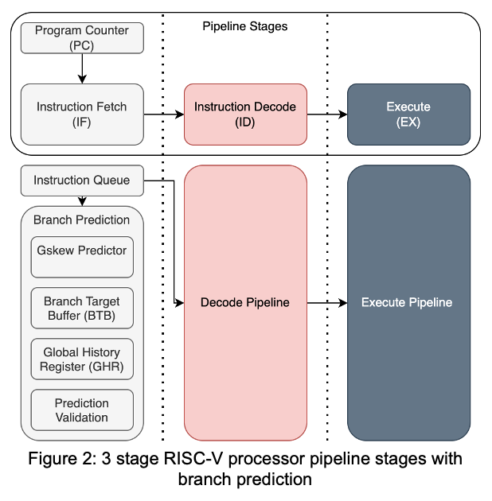
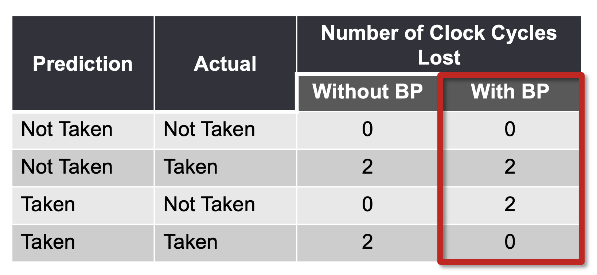
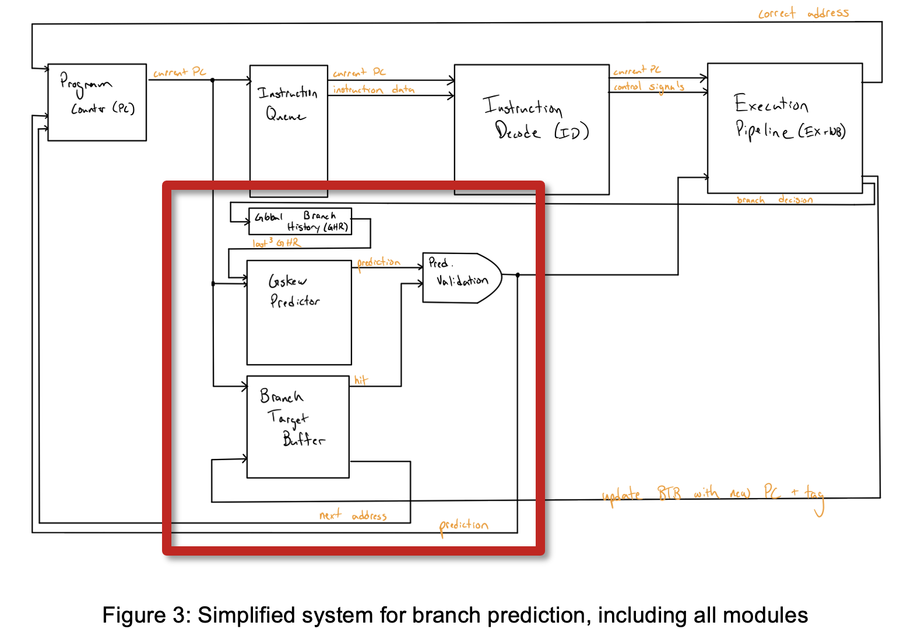
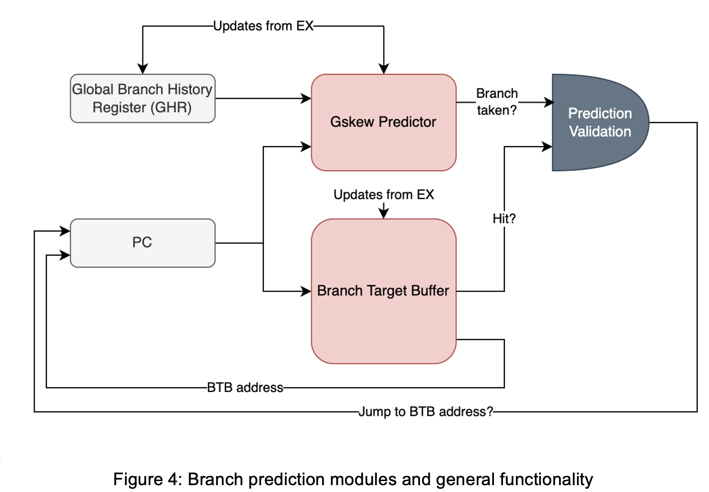
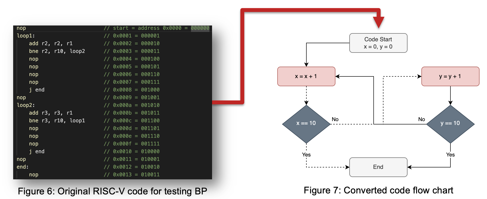
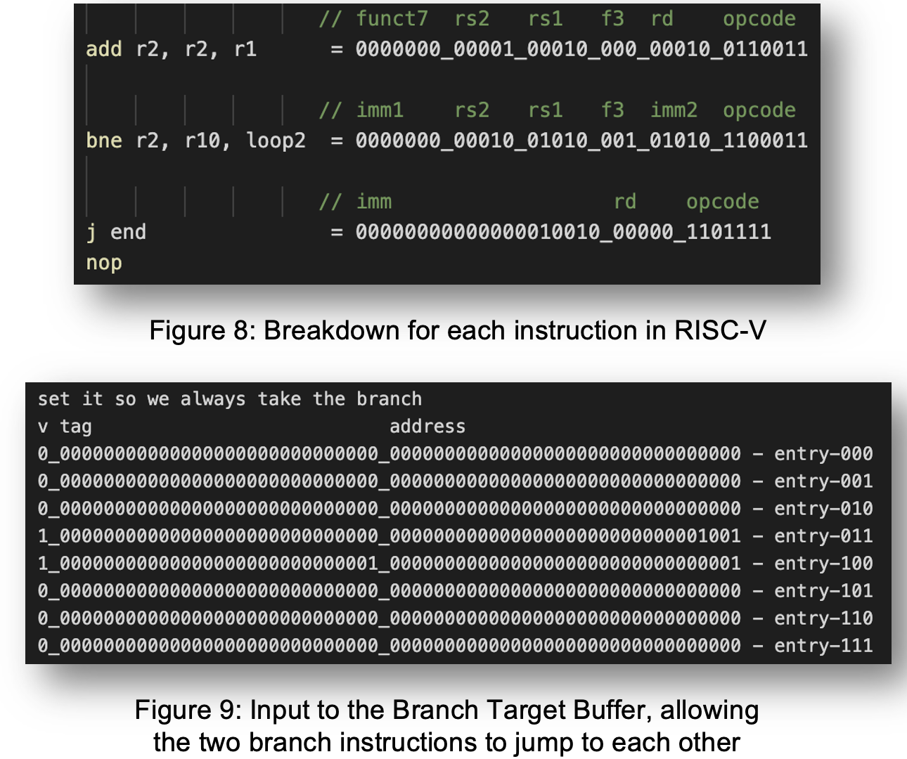
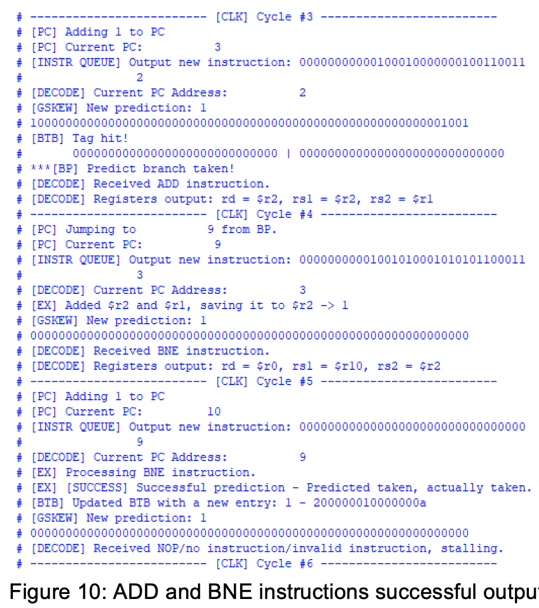
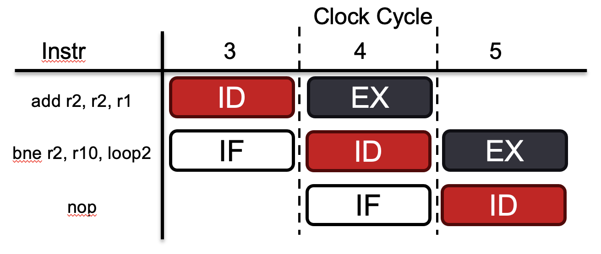
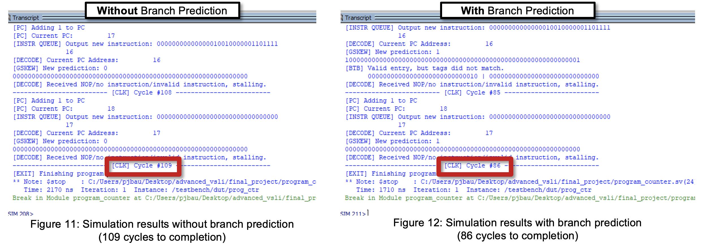

# Branch Prediction

## 1 | Introduction to Branch Prediction

Branch Prediction (BP) is a technique used in CPU design to guess the outcome of a conditional statement before it is calculated [1]. Essentially, it is used to decide whether to take or not take, a branch/jump instruction based on the PC and branch history.

Various forms of dynamic branch predictors:
* 1-bit predictors – for each branch, remember the last outcome
* 2-bit predictors – introduce strong/weak taken and not taken
* 2-level predictors – introduce a global history

This project’s design uses a simplified 3-stage RISC-V processor architecture. Instead of having the typical 5-stage pipeline, the execution (EX), memory (MEM), and write-back (WB) stages have been aggregated. The goal is to leverage branch prediction to minimize the number of clock cycles lost. With branch prediction, there is the potential to save many clock cycles in a modern CPU.

There are 4 cases for a branch/jump instruction. They are shown in the figure below. Without branch prediction, the processor always assumes that the branch is not taken. When the branch is taken in this case, the pipeline must be flushed, and the pipeline must start from the branch address. 

With branch prediction, the penalty occurs only when the branch prediction algorithm is incorrect, as shown below. This allows the CPU to rely on branch prediction for saving cycles. This is beneficial because modern branch predictors have >95% accuracy [2].

## 2 | System Architecture

The idea behind this architecture is to combine three different methodologies to improve the performance of the CPU. The first idea is to use both a global and local branch history. The second is to utilize a Branch Target Buffer (BTB) to save addresses, allowing for branch prediction in the instruction fetch stage. The last is to utilize the Gskew predictor, which uses different hash functions to determine the branch decision based on the PC and global history. 

For this project, 8 individual modules were designed. 

**4 modules for RISC-V CPU pipeline**
* **Program Counter (PC)** - holds the program count for the instruction queue to read
* **Instruction Queue** - pre-load and hold all the instructions
* **Instruction Decode Pipeline** - decode the received instruction
* **Execution Pipeline** (Includes EX+MEM+WB stages) - simplified execution pipeline, includes ALU, BNE, and JAL instruction execution

**4 modules for Branch Prediction**

* **Global Branch History Register** (GHR) - shift register to listen to all the branch decisions
* **Gskew Predictor** - outputs the branch prediction based on a majority vote from hashed pht entries
* **Branch Target Buffer** - hold addresses for PC jumps
* **Prediction Validation** - and gate between HIT from BTB and Gskew predictor

The figure above shows the entire system architecture with the major communication signals for each module. 

### Prediction Steps:
1. Get the last 3 GHR and PC bits
2. Decide if the branch is taken based on the Gskew predictor (next slide)
3. Check if there is a hit in the BTB
4. If and only if both are true, output true to PC, taking the BTB address

Above is the full branch prediction implementation, which is highlighted in Figure 3. This representation shows each signal and helps define the function of each component. It allows the prediction steps to be examined closely.

Using the prediction steps, the first step is to get the GHR and PC bits. 

## 3 | Testing and Results

The goal of testing is to see the performance difference between a system with branch prediction and one without branch prediction. The image below shows the test code that was written using the RISC-V ISA. 

 

Following the code diagram in Figure 7 allows an easier visualization of the program. Starting with two variables x and y, they are both initialized to 0. Then, x is incremented by 1. It is then checked to see if it is equal to 10, which it is not, so the next step is to branch to the next instruction. Next, y is incremented by 1 and checked against the value 10. It is not yet, so the program branches back to the instruction that adds 1 to x. This cycle continues until x is equal to 10. At that point, the program jumps to the end.

Since there are a lot of branch instructions here, the idea is that implementing branch prediction in this simple case will save a lot of cycles because there will be fewer mispredictions. 

The next step before fully testing the implementation is to translate the instructions to binary. This is accomplished following the RISC-V ISA, however, some instructions were slightly modified. Keeping the same opcode and funct3/funct7 values, the SB and UJ instructions were edited. The SB instruction that was implemented was "branch if not equal" otherwise known as "bne". The modified sections were the imm1 and imm2 fields. Originally, the bits are re-arranged so they are in a specific format. However, in this implementation, they are simply concatenated to form a 12-bit address. This 12-bit address is extended to 32 bits, but it is still enough for this program. 

Following suit, the UJ instruction is the "jump", or "j", instruction. This is essentially the "jump and link" instruction with the destination register set to 0x0000. 

Next, in Figure 9, it shows the branch target buffer and how it is loaded. Essentially, all that is accomplished with this binary is the saved tags and addresses that the branches want to jump to.

Lastly, before testing can occur, the PHT must be loaded. For this testbench, a simple pattern was loaded. Each of the 8 entries was loaded with a "10", which signifies a weak taken. This enables branch prediction. They could also have been loaded with a "11" which signifies a strong taken. During the test where no branch prediction occurs, the PHT is simply loaded with "00" which signifies a strong not taken. This means that the branch is never taken, and will mispredict every time for this program.

<!-- breakdown instructions -->

### Results

The figure below shows a snippet of the output from a run with branch prediction. The console output shows the signals printing successfully, in the correct order. 

Breaking the image above into clock cycles and instructions, the diagram below can be generated. In each clock cycle, one stage of the pipeline is occurring. The first instruction "add r2, r2, r1" is in the instruction decode (ID) stage for clock cycle 3. In clock cycle 4 it is in execution. In this simplified RISC-V architecture, this instruction executes in 1 cycle and also writes to memory in one cycle. This is indicated by the line "[EX] Added $r2 and $r1, saving it to $r2 -> 1". 

The next instruction to look at is the bne instruction. Analyzing it in clock cycle 3, it is first in the instruction fetch stage. This is the stage where branch prediction occurs. The prediction shown is the line "***[BP] Predict branch taken!". This allows the PC to branch to 9 early instead of incrementing from 3 to 4. Next, in clock cycle 5, the bne instruction is in execution. This is the stage where the branch prediction is checked. The outcome is successful and indicated by the line "[EX] [SUCCESS] Successful prediction - Predicted taken, actually taken." This shows that branch prediction has been implemented successfully. 

Figures 11 and 12 below show the simulation output and allow for performance comparison. On the left, without branch prediction, the simulation finishes the program in 109 cycles. However, with successful branch prediction, it only takes 86 cycles, saving 23 clock cycles. This is a 21% reduction. It's worth noting that a much greater improvement in performance can occur depending on the number of pipeline stages. With more stages, the branch prediction can save more cycles if implemented correctly. Another point worth analyzing is the corner case where branch prediction is performed poorly. Some programs are written so they do not work with branch predictors, and could even result in a 0% accuracy. This is all program and system-dependent, so these principles must be taken into account during the processor design stage. 

## 4 | Conclusion and Future Work

The idea of combining the Gskew predictor with the BTB allowed for this implementation to perform branch prediction accurately at the IF stage. Additionally, the program used to test the branch prediction can be modified in any way as long as the instructions are understood well. This allows for flexibility in testing the performance of the system. Lastly, a 21% runtime reduction was achieved using this architecture. This is of course based well on the type of program that is run, as well as the number of cycles in the pipeline as mentioned previously. 

For future work, there are a lot of improvements or modifications that could be made to the system. Firstly, there was some missing functionality in the PHT. It does not fully update based on the recent branch decision like the GHR currently does. It would be good to fully implement this and test to see how well the predictor works. Next, the program could be extended or modified to see how it stacks up against other integer and branch operation sequences. Additionally, implementing more instruction and instruction types would allow for more complex programs to be executed on this architecture.

One other major test to consider is the power test. Seeing how this architecture affects power performance would be an interesting metric, and would certainly be a key point in the quest for better CPU performance.

<!-- Want to see power performance -->

## References
[1] What is a Branch Prediction, “What is a Branch Prediction?,” Computerhope.com, 2017. 	https://www.computerhope.com/jargon/b/branch-prediction.htm

‌[2] L. Liu, Class Lecture, Topic: “Advanced Computer Architecture: Branch Prediction.”, ECSE 4780/6700, 	College of Engineering, Rensselaer Polytechnic Institute, Troy, NY, Mar. 2024.

[3] L. Liu, Class Lecture, Topic: “Advanced Computer Architecture: Branch Prediction II.”, ECSE 4780/6700, 	College of Engineering, Rensselaer Polytechnic Institute, Troy, NY, Mar. 2024.

[4] ltziyan He, “Design a Three-Stage Pipelined RISC-V Processor Using SystemVerilog KTH Thesis 	Report.” Available: https://www.diva-portal.org/smash/get/diva2:1713647/FULLTEXT01.pdf

‌[5] Mutlu, “8-740/640 Computer Architecture Lecture 5: Advanced Branch Prediction,” 2015. Accessed: Apr. 	12, 2024. [Online]. Available: https://course.ece.cmu.edu/~ece740/f15/lib/exe/fetch.php?media=18-	740-fall15-lecture05-branch-prediction-afterlecture.pdf
‌

